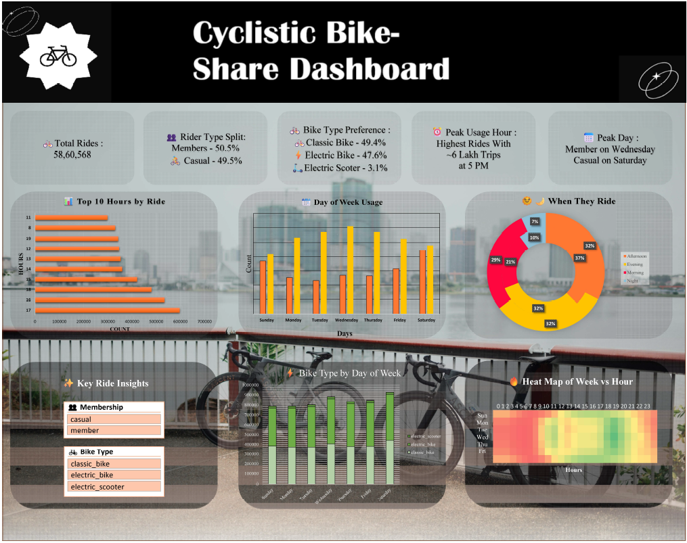

# 🚴 Cyclistic Bike-Share Dashboard (Excel)

An interactive Excel dashboard built to analyze Cyclistic bike-share data.  
This project provides insights into rider behavior, peak usage hours, bike preferences, and weekly ride patterns.

---

## 📌 Project Objective

To analyze Cyclistic bike-share data and identify:

- Rider type distribution (Member vs Casual)
- Peak ride hours and peak days
- Bike type preferences
- Ride trends by day and hour
- Usage patterns across the week

The goal is to derive business insights that can help convert casual riders into annual members.

---

## 📊 Dashboard Overview

The dashboard includes:

### 🔢 Key Metrics
- Total Rides
- Rider Type Split (Member vs Casual)
- Bike Type Preference
- Peak Usage Hour
- Peak Day by Rider Type

### 📈 Visualizations
- Top 10 Hours by Ride Count
- Day of Week Usage (Bar Chart)
- Time of Day Distribution (Donut Chart)
- Bike Type by Day of Week
- Week vs Hour Heatmap

---

## 🛠 Tools & Techniques Used

- Microsoft Excel
- Pivot Tables
- Pivot Charts
- Conditional Formatting
- Heatmaps
- Data Cleaning & Transformation
- KPI Card Design
- Dashboard Layout & UI Formatting

---

## 📂 Dataset

The dataset contains historical ride data including:
- Ride ID
- Rideable Type
- Member/Casual
- Start Time
- Day of Week
- Ride Duration

(Data source: Cyclistic case study dataset)

---

## 🔍 Key Insights

- Peak ride hour occurs at **5 PM**
- Members ride more on weekdays
- Casual riders peak on weekends
- Classic bikes are slightly more preferred than electric bikes
- Evening and Afternoon are the busiest time slots

---

## 💡 Business Recommendation

- Offer weekday membership discounts targeting casual weekend riders.
- Promote electric bikes during peak commuting hours.
- Launch targeted campaigns around peak usage times.

---

## 📸 Dashboard Preview

  

---

## 👨‍💻 Author

**Ehsaas Choudhary**  
B.Tech CSE (AIML)  
Aspiring Data Analyst | Excel | Power BI | Tableau | Python  

---

⭐ If you found this project useful, feel free to star the repository!
